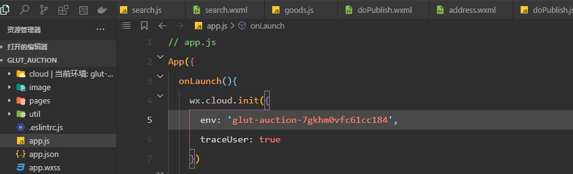

# glut_auction

#### 介绍
一个校园竞拍微信小程序，因为规模较小，仅限单个学校使用，竞拍时不用付款，因为个人小程序不允许使用支付接口，出价时价高者可获得卖家联系方式，进行线下交易。

### 效果演示
整体预览：%2000_00_00-00_00_30.gif)
1、发布商品

2、参与商品竞拍

3、搜索商品

4、管理发布的商品

5、查看自己的竞拍记录

#### 软件架构
微信小程序、微信云开发。

#### 安装教程

1.  云开发数据库需要有5张表，虽然只有5张表，但是实际开发很多数据都需要多表联查。

2.  修改云开发环境

3.  测试阶段需要允许发布者本身可以参与自己的竞拍，上线阶段要设置卖家不能参与自己发布的商品的竞拍。

#### 开发文档地址
博客园地址：https://www.cnblogs.com/lishilin-glut/

